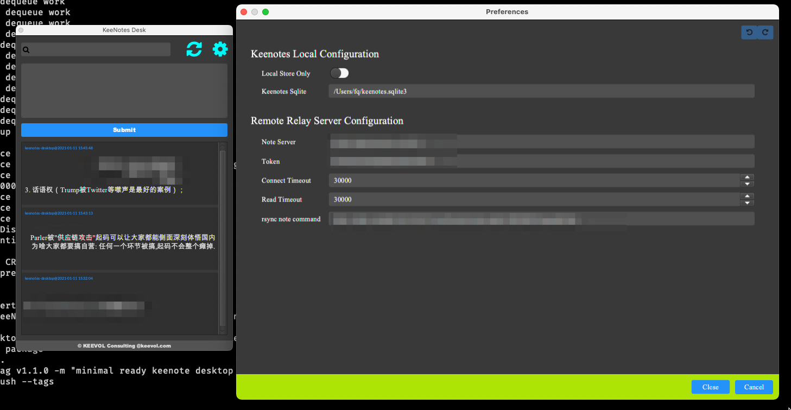
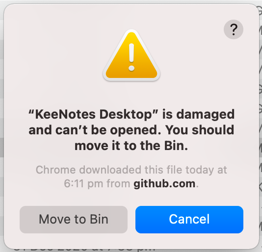

# KeeNotes Desktop

keenotes的桌面客户端，一个个人的闪念知识库。

可以直接[下载MacOS版](https://github.com/keevol/keenotes-desktop/releases)使用。

# 常见问题（You Might Want to know)

## dmg文件损坏（dmg file damaged/warning/error）

如果你遇到如下问题：

可以这样: `sudo xattr -d com.apple.quarantine /Applications/KeeNotes\ Desktop.app`

应该是Mac的安全机制导致，可能是因为我本地编译发布，没有做认证的缘故。

# 相似产品

- https://supernotes.app/
- https://memordo.com/app/public/325
- https://flomoapp.com/
- https://idea.xinxiao.tech/

