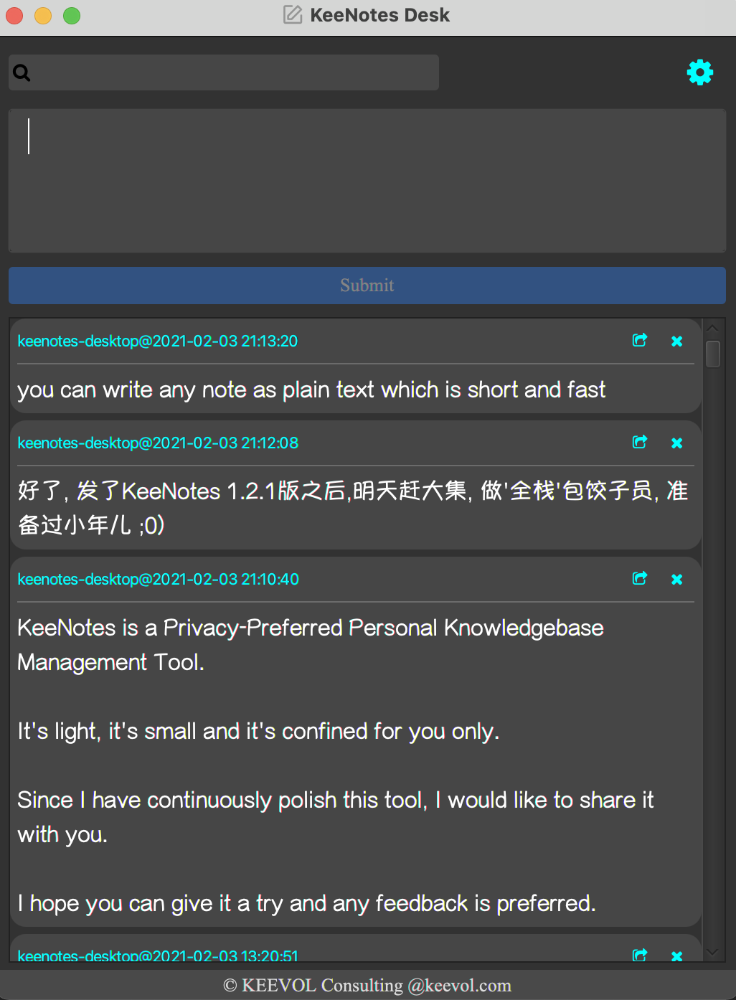

# KeeNotes Desktop

keenotes的桌面客户端，一个个人的闪念知识库。

KeeNotes is a Privacy-Preferred Personal Knowledgebase Management Tool.

It's light, it's small and it's confined for you only.

Since I have continuously polish this tool, I would like to share it with you.

I hope you can give it a try and [any feedback](https://github.com/keevol/keenotes-desktop/issues) is preferred.

可以直接[下载MacOS版](https://github.com/keevol/keenotes-desktop/releases)使用。

# 常见问题（You Might Want to know)

## dmg文件损坏（dmg file damaged/warning/error）

如果你遇到如下问题：

可以这样: `sudo xattr -d com.apple.quarantine /Applications/KeeNotes\ Desktop.app`

应该是Mac的安全机制导致，可能是因为我本地编译发布，没有做公证(Package Notarization)的缘故。（我不是典型的apple开发者，所以也没法做公证^_-）

# 相似产品

- https://supernotes.app/
- https://memordo.com/app/public/325
- https://flomoapp.com/
- https://idea.xinxiao.tech/

